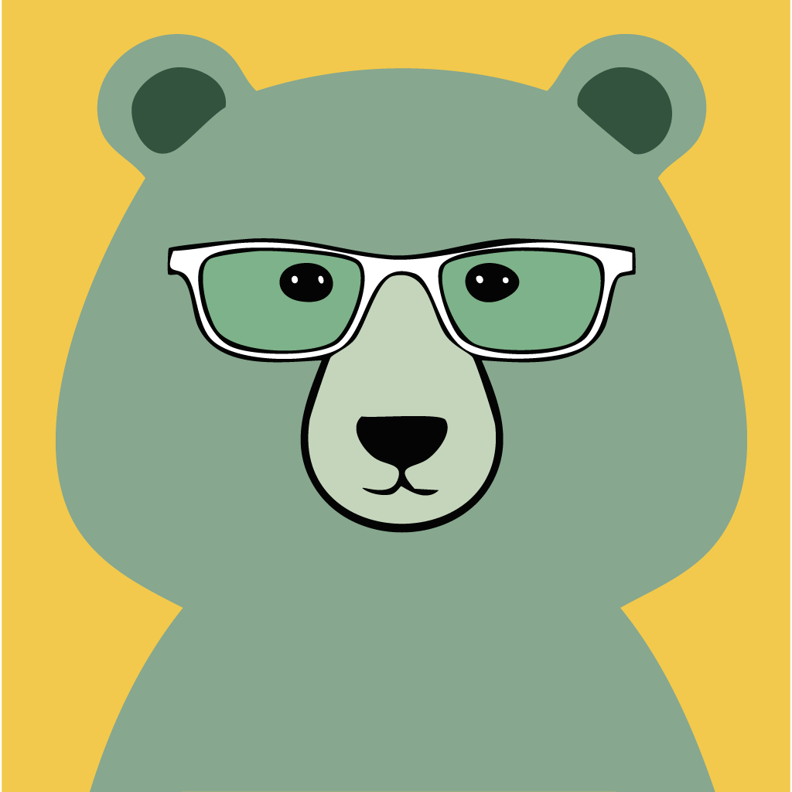

# 🐻 Quizzly Bear

An open-source offline pub quiz application designed for hosting engaging quiz nights. Run professional-quality trivia games with teams, multiple question types, and customizable quiz packs—all without needing an internet connection.



## ✨ Features

### 🎮 Complete Quiz Experience
- **Team Management**: Create and manage multiple teams with persistent scoring
- **Professional Game Flow**: Round intros → Questions → Answer reveals → Score entry → Leaderboards
- **Keyboard Navigation**: Host controls with spacebar, arrow keys, and F11 for fullscreen
- **Offline Operation**: No internet required—perfect for venues with poor connectivity

### 📚 Flexible Content System
- **5 Question Types**: Text answers, multiple choice, true/false, closest number, and image questions
- **Themed Rounds**: Organize questions into themed rounds (5-6 questions each)
- **Pack Management**: Import/export quiz packs, create custom content
- **Community Packs**: Access to growing library of community-created quiz packs

### 🎨 User Experience
- **Clean Bear-Themed UI**: Professional yet playful design
- **Projection Ready**: Optimized for laptop → projector setup
- **Responsive Design**: Works on various screen sizes
- **Accessibility**: Keyboard navigation and clear visual hierarchy

## 🚀 Quick Start

### Download & Install
1. **Download** the latest release from [GitHub Releases](https://github.com/smw355/quizzly-bear/releases):
   - 🍎 **Mac**: `Quizzly.Bear-1.0.8.dmg` (Intel) or `Quizzly.Bear-1.0.8-arm64.dmg` (Apple Silicon)
   - 🪟 **Windows**: `Quizzly.Bear.Setup.1.0.8.exe`
   - 🐧 **Linux**: `Quizzly.Bear-1.0.8.AppImage`

2. **Install** and launch the application
   
   > **macOS Security Note**: On first launch, macOS may show a security warning because the app isn't code signed. To open:
   > - Right-click the app → "Open" → "Open" in the dialog, OR
   > - Open normally → Go to System Settings → Privacy & Security → Click "Open Anyway"

3. **Select a Quiz Pack** from the included content or import your own

4. **Set up Teams** for your quiz night

5. **Start Gaming!** Use spacebar to advance through questions

### First Game
1. Choose "Bear Essentials" (included 10-round pack)
2. Add teams using the + button
3. Click "Start New Game"
4. Use **spacebar** to navigate through the game
5. Enter scores after each round
6. View final leaderboard

## 📦 Quiz Pack System

### Included Packs
- **🐻 Bear Essentials** (10 rounds): Bear-themed questions across various topics
- **🤔 Quizzlies Quirky Questions Vol 1** (10 rounds): Creative and unusual trivia
- **⛷️ Skiing Around The World** (10 rounds): Global skiing destinations and culture
- **🌉 Northern California Chronicles** (10 rounds): Bay Area and Northern California

### Community Packs
Browse and download additional packs from our [Community Pack Library](community-packs/) or create your own!

### Creating Quiz Packs
See our [Pack Creation Guide](docs/creating-quiz-packs.md) for detailed instructions on creating custom quiz packs.

## 🎯 Question Types

| Type | Description | Example |
|------|-------------|---------|
| **Text Answer** | Open-ended text response | "What is the capital of France?" |
| **Multiple Choice** | 4 options, 1 correct | A) Paris B) London C) Berlin D) Madrid |
| **True/False** | Boolean question | "The Earth is flat." |
| **Closest Number** | Numerical guess, closest wins | "How tall is the Eiffel Tower in feet?" |
| **Image** | Picture-based question | Show image of landmark, ask for name |

## 🛠️ Development

### Prerequisites
- Node.js 18+
- npm or yarn

### Setup
```bash
# Clone the repository
git clone https://github.com/smw355/quizzly-bear.git
cd quizzly-bear

# Install dependencies
npm install

# Start development server
npm run electron-dev
```

### Available Scripts
- `npm run dev` - Start Vite development server
- `npm run build` - Build for production
- `npm run electron-dev` - Run Electron in development mode
- `npm run build-electron` - Build Electron app for distribution
- `npm run dist` - Create distribution packages
- `npm run lint` - Run ESLint for code quality

### Building for Distribution
```bash
# Build for all platforms
npm run build-electron

# Output will be in the 'release' directory
```

## 🤝 Contributing

We welcome contributions! Please see our [Contributing Guide](CONTRIBUTING.md) for details.

### Ways to Contribute
- 🐛 **Bug Reports**: Found an issue? Let us know!
- 💡 **Feature Requests**: Have an idea? We'd love to hear it!
- 📦 **Quiz Packs**: Create and share quiz packs with the community
- 💻 **Code Contributions**: Help improve the app itself

### Creating Community Quiz Packs
1. Follow our [Pack Creation Guide](docs/creating-quiz-packs.md)
2. Test your pack thoroughly
3. Submit a Pull Request to the [community-packs](community-packs/) directory
4. Include proper attribution and licensing

## 📄 License

This project is licensed under the MIT License - see the [LICENSE](LICENSE) file for details.

## 🙋‍♂️ Support

- 📖 **Documentation**: Check the [docs](docs/) folder
- 🐛 **Issues**: Report bugs on [GitHub Issues](https://github.com/smw355/quizzly-bear/issues)
- 💬 **Discussions**: Join conversations in [GitHub Discussions](https://github.com/smw355/quizzly-bear/discussions)

## 🎉 Acknowledgments

- Built with React, TypeScript, and Electron
- Inspired by pub quiz culture and community trivia nights
- Icons and design elements created with ❤️ for the trivia community

---

**Made with 🐻 and ☕ for quiz hosts everywhere**

Ready to host your first quiz night? [Download Quizzly Bear](https://github.com/smw355/quizzly-bear/releases) and get started!